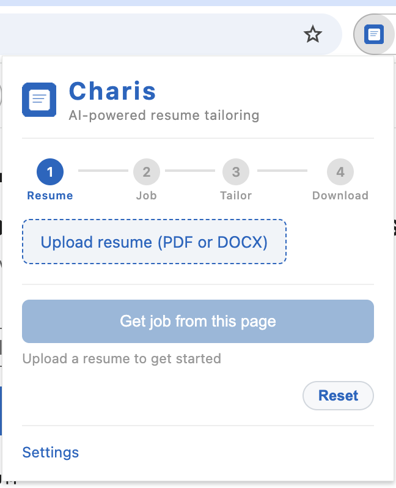
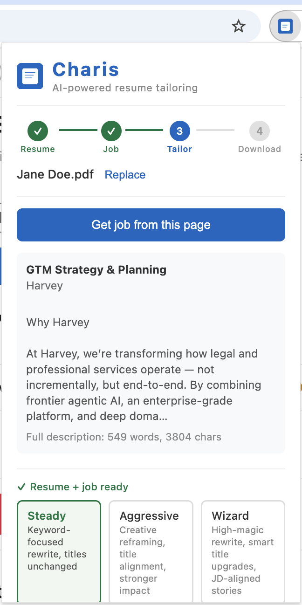
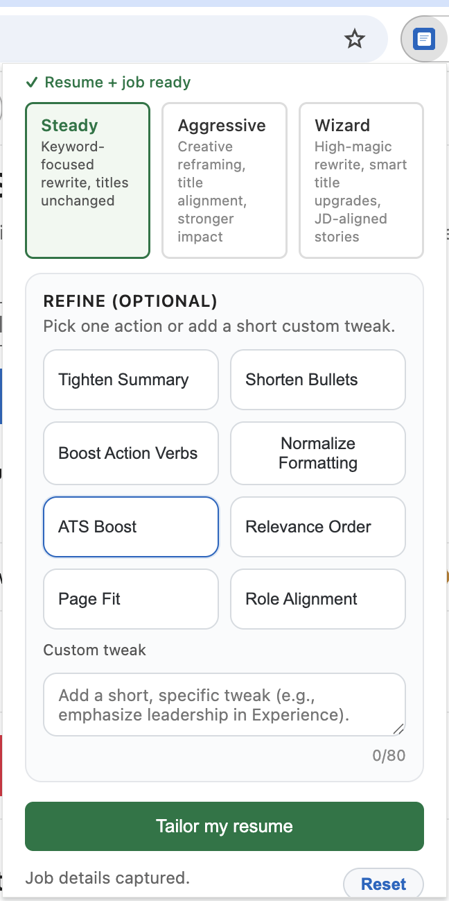
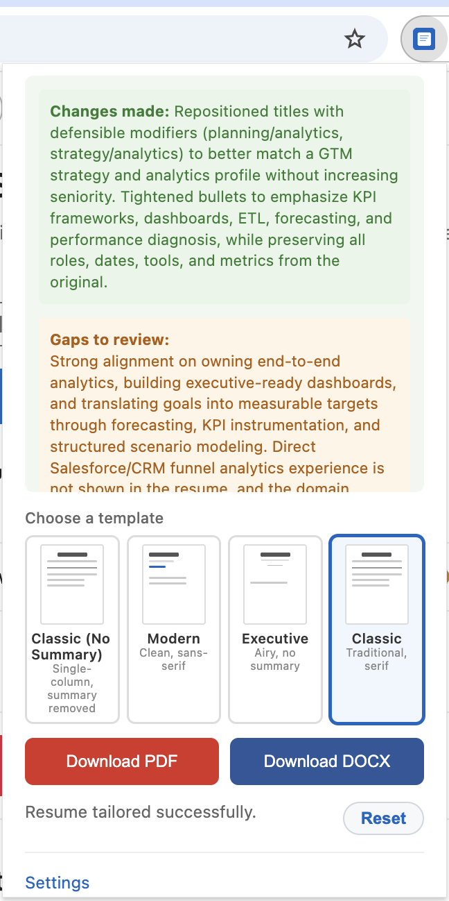

# Charis

AI-powered resume tailoring for LinkedIn job posts — fast, focused, and ATS-friendly.

## Why Charis

Charis helps you align your resume with a specific job description without inventing facts. You get a tailored version that stays faithful to your experience while improving relevance, clarity, and keyword alignment.

## What it does

- Pulls job title, company, and description from the active LinkedIn job page
- Tailors your resume in **Steady**, **Aggressive**, or **Wizard** modes
- Optional refinement actions (e.g., shorten bullets, ATS keyword boost, relevance reordering)
- Keeps output ATS-safe (no tables/graphics)
- Exports to PDF (and DOCX for supported templates)

## Setup (API key)

1) Open the extension popup  
2) Click **Settings**  
3) Paste your OpenAI API key and save

Your API key is stored locally in Chrome storage and is never committed to this repo.

## Templates

- Classic (No Summary)
- Modern (No Summary)
- Executive
- Classic

## Privacy & safety

Your resume and job description are used only to generate a tailored version. The tool is designed to avoid fabricating experience, tools, or metrics.

## Screenshots

### 1. Upload your resume

  

Start by uploading your PDF or DOCX resume. Charis uses this as the base document for tailoring.

### 2. Capture the job and choose a mode

  

Pull the job description from the active LinkedIn page, then pick **Steady**, **Aggressive**, or **Wizard** depending on how strongly you want the resume reframed.

### 3. Apply optional refinements

  

Use targeted refinement actions such as ATS boosting, bullet shortening, relevance ordering, or role alignment.

### 4. Review changes and download

  

Review the generated changes, inspect gaps to address, choose a template, and export the tailored resume.

## License

This project is **source-available** under the **PolyForm Noncommercial 1.0.0** license.  
Commercial use is not permitted. See `LICENSE`.
